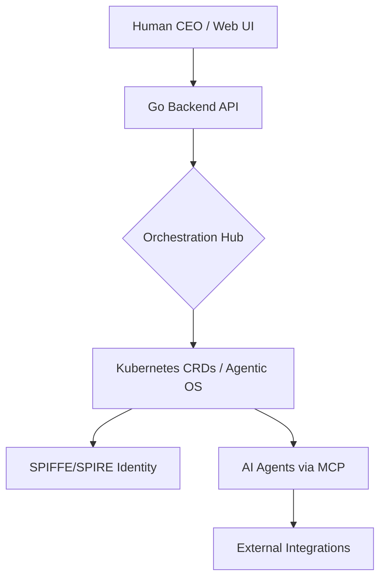

# One Human Corp

## Identity
One Human Corp is an innovative Cloud-Native Hybrid Architecture (Agentic OS) that empowers a single individual to run an entire enterprise by orchestrating highly specialized AI agents natively on Kubernetes.

## Architecture
Built on a modular, open-source stack (Model Context Protocol, SPIFFE/SPIRE, LangGraph/CrewAI), the system leverages Kubernetes Custom Resource Definitions (CRDs) to manage the organisational structure as Infrastructure as Code. The backend is written in Go (Bazel-based monorepo), and it integrates with a React Next.js-style frontend to allow the human CEO to direct virtual meeting rooms, handle high-risk approvals, and monitor token usage and billing.



## Quick Start
1. Ensure you have `bazelisk` and `npm` installed.
2. Build the backend:
   ```bash
   bazelisk build //...
   ```
3. Run all tests to verify the setup:
   ```bash
   bazelisk test //...
   ```
4. Run the Go backend (Dashboard Server) locally on port `8080`.
5. In parallel, run the frontend dev server:
   ```bash
   cd srcs/frontend
   npm install
   npm run dev
   ```
6. Access the dashboard at `http://localhost:5173`.

## Developer Workflow
This project uses Bazel for deterministic builds and testing.
- **Build all modules:** `bazelisk build //...`
- **Run all tests:** `bazelisk test //...`
- **Format code:** Use standard `gofmt` for Go and Prettier for the frontend.

## Configuration
The following environment variables and configurations are commonly used:
- `GEMINI_API_KEY`: API Key for Gemini models (if using Google models).
- `MCP_BUNDLE_DIR`: Directory for MCP bundles.
- `MONO_FRONTEND_DIST`: Path to the compiled frontend dist directory.
- Kubernetes Secrets are used to inject runtime credentials safely without committing secrets to the repo.
