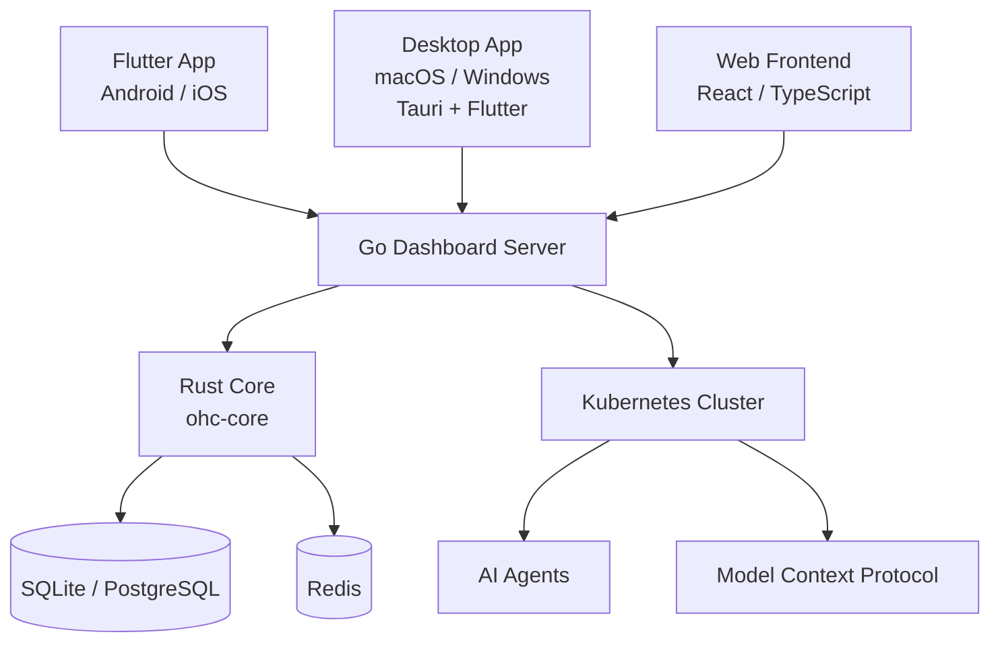

# One Human Corp

## Identity
One Human Corp is an innovative Cloud-Native Hybrid Architecture (Agentic OS) that empowers a single individual to run an entire enterprise by orchestrating highly specialized AI agents natively on Kubernetes.

## Architecture

The platform ships in two modes:

| Mode | Description |
|------|-------------|
| **Single-docker** | One container for everything.  The `ohc-core` Rust library handles all performance-critical logic (settings, agent scheduling, meeting rooms, chat integration). |
| **Cloud-native (k8s)** | Kubernetes deployment with full multi-tenant support.  A single server instance handles thousands of companies; each user sees only their own company's data. |



### Source layout (`srcs/`)

| Directory | Language | Purpose |
|-----------|----------|---------|
| `srcs/core/` | **Rust** | Core library — settings, agent lifecycle, scheduler, meeting rooms, chat integration |
| `srcs/app/` | **Flutter/Dart** | Cross-platform app (iOS, Android, macOS, Windows, Linux, Web) |
| `srcs/desktop/` | **Tauri (Rust + React)** | Native desktop app (macOS, Windows) |
| `srcs/frontend/` | **TypeScript/React** | Web dashboard |
| `srcs/dashboard/` | **Go** | REST API server with multi-tenant `TenantRegistry` |
| `srcs/auth/` | **Go** | JWT, OIDC, RBAC with `organization_id` scoping |
| `srcs/orchestration/` | **Go** | Agent hub, meeting rooms |
| `srcs/agents/` | **Go** | AI provider registry |
| `srcs/domain/` | **Go** | Business models (Organisation, Blueprint, B2B) |
| `srcs/proto/` | **Protobuf** | gRPC service definitions |

### Multi-tenancy

In cloud-native mode (`OHC_MULTITENANT=true`) the `TenantRegistry` in
`srcs/dashboard/tenant.go` routes every authenticated request to the correct
per-organisation `Server` instance.  Each organisation's data (agents,
meetings, messages, approvals, …) is fully isolated.

New organisations are provisioned via:
```
POST /api/orgs/register   { "id": "acme", "name": "Acme Corp", "domain": "acme.com" }
```
After provisioning, users whose JWT includes `"organization_id": "acme"` are
routed exclusively to the Acme tenant.

## Quick Start

### Docker (single-machine deployment)

```bash
cd deploy
docker compose up
```

Services:
| Service | Port | Description |
|---------|------|-------------|
| `ohc-core` | 18789 | Rust core micro-service |
| `backend` | 8080 | Go dashboard API |
| `frontend` | 8081 | React web dashboard |
| `postgres` | 5432 | PostgreSQL |
| `redis` | 6379 | Redis |
| `chatwoot` | 3002 | Chat platform |
| `prometheus` | 9090 | Metrics |
| `grafana` | 3000 | Dashboards |

### Bazel (full build + test)

```bash
bazelisk build //...
bazelisk test //...
```

### Flutter app

```bash
cd srcs/app
flutter pub get
flutter run -d macos    # or -d windows / -d android / -d ios / -d chrome
```

### Rust core

```bash
cd srcs/core
cargo build --release
cargo test
```

## Configuration

| Variable | Description |
|----------|-------------|
| `GEMINI_API_KEY` | Google Gemini API key |
| `ANTHROPIC_API_KEY` | Anthropic API key |
| `OPENAI_API_KEY` | OpenAI API key |
| `OHC_MULTITENANT` | Set `true` for multi-tenant cloud-native mode |
| `OHC_CORE_URL` | URL of the Rust `ohc-core` sidecar |
| `MCP_BUNDLE_DIR` | Directory for MCP bundles |
| `MONO_FRONTEND_DIST` | Path to compiled frontend dist |

Kubernetes secrets are used to inject credentials at runtime without committing them to source.

## Developer Workflow

- **Build all modules:** `bazelisk build //...`
- **Run all tests:** `bazelisk test //...`
- **Format Go code:** `gofmt -w ./...`
- **Format frontend:** `cd srcs/frontend && npx prettier --write .`
- **Lint Rust:** `cd srcs/core && cargo clippy`

