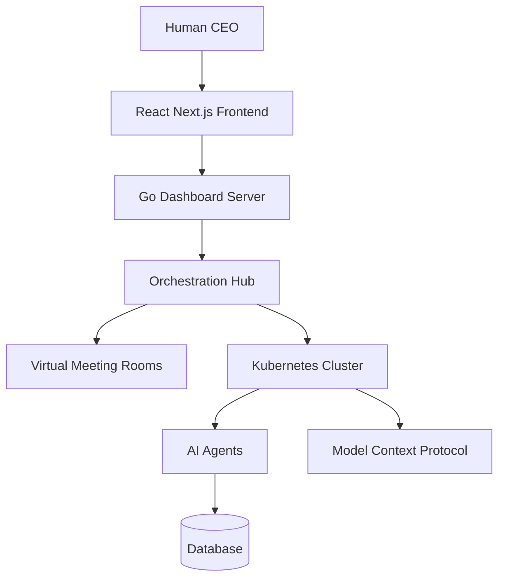

# One Human Corp: Platform Documentation


<div style="backdrop-filter: blur(15px) saturate(180%); background: rgba(255, 255, 255, 0.05); border: 1px solid rgba(255, 255, 255, 0.1); padding: 15px; border-radius: 8px;">
<strong>Premium OHC Design Token:</strong> This interface adheres to the Glassmorphism aesthetic mandate.
</div>


## Identity
One Human Corp is an innovative Cloud-Native Hybrid Architecture (Agentic OS) that empowers a single individual to run an entire enterprise by orchestrating highly specialized AI agents natively on Kubernetes. Our primary goal is to provide a framework where a customer can tackle any business area. The core structure revolves around:
1. **Domain Knowledge**: The industry the corporation operates in. Our foundational domain is the "Software Company". The system allows continuous import of new skills, domains, and knowledge bases.
2. **Roles**: The specific positions required within the domain. For a Software Company, these include:
   - **CEO**: Always the human user, overseeing high-level goals.
   - **Director**: Middle-management AI (e.g., Engineering Director, Marketing Director) guiding sub-agents.
   - **Product Manager (PM)**: Gathers requirements and scopes projects.
   - **Software Engineer (SWE)**: Writes and tests code.
   - **Security Engineer**: Audits infrastructure and enforces data privacy compliance.
   - **QA Tester**: Ensures product quality via automated testing.
   - **Marketing Manager**: Executes GTM strategies.
   - **Sales Representative**: Handles leads and conversion.
   - **Customer Support**: Resolves user issues.
3. **Organization**: The management hierarchy. For example, the human CEO commands an Engineering Director, who in turn manages 3 SWEs, 1 QA Tester, and 1 Security Engineer.
4. **Collaboration (Virtual Meeting Rooms)**: When the CEO defines a goal, multiple agents (e.g., PM, SWE, and Director) convene in Virtual Meeting Rooms to define scopes, debate technical constraints, and finalize designs before execution.

## Architecture
Built on a modular, open-source stack (Model Context Protocol, SPIFFE/SPIRE, LangGraph), the system leverages Kubernetes Custom Resource Definitions (CRDs) to manage the organisational structure as Infrastructure as Code. The backend is written in Go (Bazel-based monorepo), and it integrates with a React Next.js-style frontend to allow the human CEO to direct virtual meeting rooms, handle high-risk approvals, and monitor token usage and billing.



## Quick Start
1. Ensure you have `bazelisk` and `npm` installed.
2. Build the backend:
   ```bash
   bazelisk build //...
   ```
3. Run all tests to verify setup:
   ```bash
   bazelisk test //...
   ```
4. Run the Go backend (Dashboard Server) locally on port `8080`.
5. In parallel, run the frontend dev server:
   ```bash
   cd srcs/frontend
   npm install
   npm run dev &
   ```
6. Access the dashboard at `http://localhost:5173`.

## Developer Workflow
This project uses Bazel for deterministic builds and testing.
- **Build all modules:** `bazelisk build //...`
- **Run all tests:** `bazelisk test //...`
- **Format code:** Use standard `gofmt` for Go and Prettier for the frontend.
- **Documentation:** All feature additions must include a `cuj.md`, `design-doc.md`, and `user-guide.md` adhering to the standard templates.

## Configuration
The following environment variables and configurations are commonly used:
- `GEMINI_API_KEY`: API Key for Gemini models (if using Google models).
- `MCP_BUNDLE_DIR`: Directory for MCP bundles.
- `MONO_FRONTEND_DIST`: Path to the compiled frontend dist directory.
- Kubernetes Secrets are used to inject runtime credentials safely without committing secrets to the repo.
