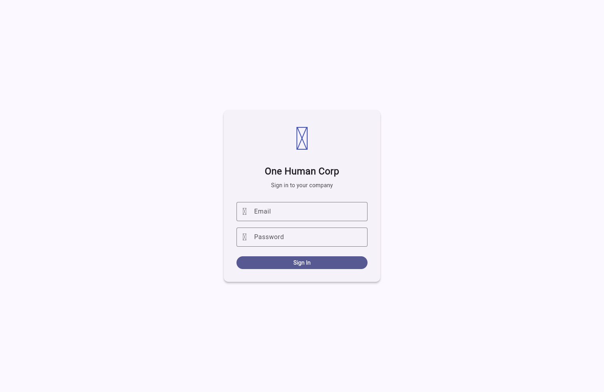
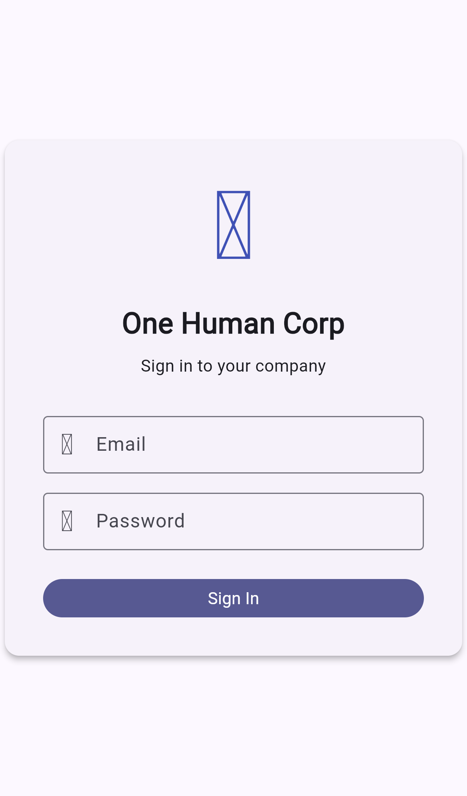
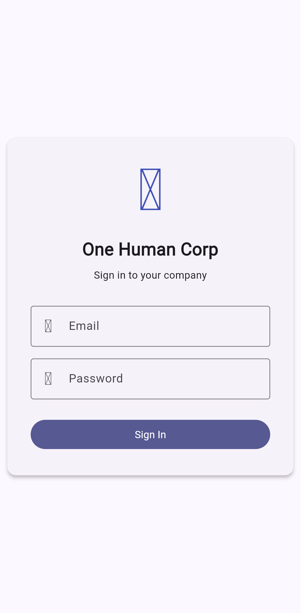

# User Guide: OHC Flutter App


<div style="backdrop-filter: blur(15px) saturate(180%); background: rgba(255, 255, 255, 0.05); border: 1px solid rgba(255, 255, 255, 0.1); padding: 15px; border-radius: 8px;">
<strong>Premium OHC Design Token:</strong> This interface adheres to the Glassmorphism aesthetic mandate.
</div>


## 1. Overview

This guide covers the Bazel-native Flutter app workflow in `srcs/app`.
The app's screenshots are generated from the Bazel-built Flutter web bundle by
running Playwright with platform-specific viewport and device profiles.

## 2. Regenerate Screenshots

Run either of the following from the repository root:

```bash
bazelisk run //srcs/app:capture_screenshots
```

Or use the VS Code task `App: Capture Flutter screenshots`.

Generated images are written to:

- `docs/app/web/`
- `docs/app/macos/`
- `docs/app/ios/`
- `docs/app/windows/`
- `docs/app/android/`
- `docs/app/linux/`

## 3. Screenshot Gallery

### Web


### macOS



### iOS



### Windows


### Android



### Linux


