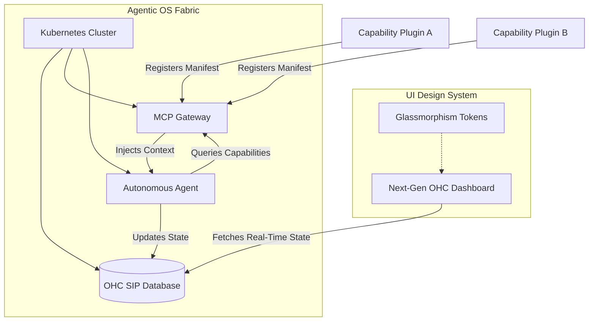

# Design Doc: Next-Generation Modular Plugin & Aesthetic OS Vision

**Author(s):** Principal Product Architect & Visionary (L7)
**Status:** Approved
**Date:** 2026-03-29

## 1. Vision Audit: The Autonomy Bottleneck
**Problem Identification:** The current architectural dependency on hardcoded `Skill Blueprints` (JSON/Protobuf templates) and static Kubernetes CRDs limits 100% agent autonomy. A "stale" feature is the rigid `Organization` model and `RoleProfile` schemas. They require the human CEO or platform engineers to manually map out domains before agents can operate. This structural bottleneck prevents agents from autonomously discovering, synthesizing, and adopting new capabilities on the fly.

**Resolution:** Transition to a **Modular, Plugin-Based Capability System**. Agents must be able to dynamically ingest "Capability Plugins" at runtime, expanding their own tooling and organizational roles without platform updates.

## 2. Blueprint: The Modular Agentic OS

The "Agentic OS" roadmap is hereby updated to replace static `Skill Blueprints` with a dynamic, decentralized **Capability Plugin Mesh**.

### 2.1 Capability Plugins
Instead of uploading static JSON to the Orchestration Hub, capabilities are hosted as standalone K8s services exposing a standardized `CapabilityManifest`.
*   **Discovery**: Agents query the MCP Gateway for capabilities matching their intent.
*   **Dynamic Binding**: The Hub dynamically registers new endpoints and injects them into the agent's context.
*   **Zero-Downtime Expansion**: The entire org chart and toolset can morph in real-time.

### 2.2 DB-SIP Schema Evolution
To support this, the Swarm Intelligence Protocol (SIP) memory types must evolve.

```sql
-- New DB-SIP Schema for Capabilities
CREATE TABLE IF NOT EXISTS capability_plugins (
    plugin_id TEXT PRIMARY KEY,
    name TEXT NOT NULL,
    version TEXT NOT NULL,
    manifest_url TEXT NOT NULL,
    status TEXT NOT NULL,
    registered_at DATETIME DEFAULT CURRENT_TIMESTAMP
);

-- Expanding Swarm Memory for Contextual Discovery
CREATE TABLE IF NOT EXISTS swarm_memory_embeddings (
    memory_id TEXT PRIMARY KEY,
    context TEXT NOT NULL,
    vector_embedding BLOB,
    source_plugin TEXT,
    created_at DATETIME DEFAULT CURRENT_TIMESTAMP
);
```

## 3. Aesthetics: Next-Generation OHC Design System

To reflect the fluidity of the new Agentic OS, the OHC frontend must adopt the Next-Generation "Premium Feel" Design System.

### 3.1 Design System Tokens
The UI must hide infrastructure complexity (K8s, MCP) behind consumer-grade "Apple-level aesthetics".

*   **Backdrop & Depth**: Glassmorphism is the core structural element.
    *   `backdrop-filter: blur(20px) saturate(200%)`
    *   `background: rgba(255, 255, 255, 0.03)`
    *   `border: 1px solid rgba(255, 255, 255, 0.08)`
*   **Typography**: Clean, geometric sans-serif for clarity at a glance.
    *   `font-family: 'Outfit', 'Inter', sans-serif`
*   **Transitions**: Smooth data transitions for all asynchronous operations (e.g., capability binding).

### 3.2 Architectural Flow Diagram



## 4. Execution Plan
1. **Database Migration**: Apply the new `capability_plugins` and `swarm_memory_embeddings` tables to `ohc.db`.
2. **Handoff (SIP)**: Inject missions into the `agent_missions` table for `backend_dev` (Plugin Mesh) and `ui_dev` (Design Tokens).
3. **Verification**: Frontend CI pipeline must utilize Playwright to verify visual compliance with the Glassmorphism tokens.
