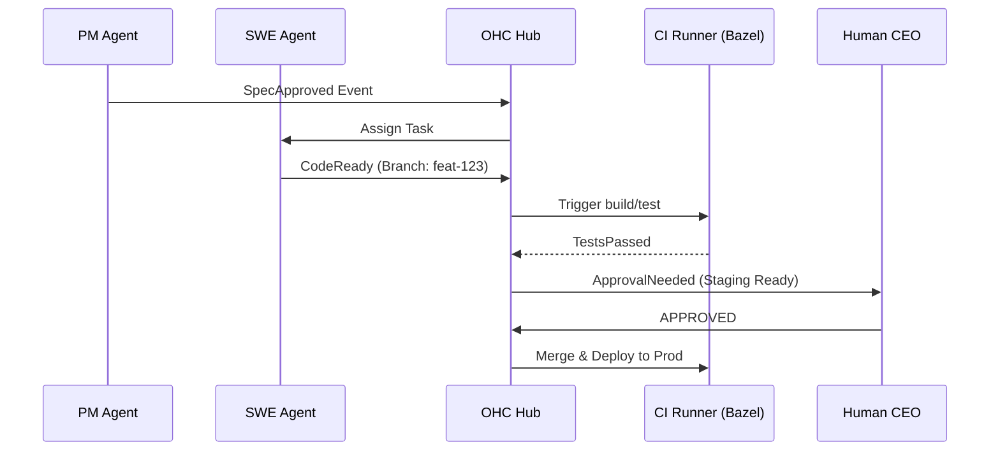

# Design Doc: Automated Implementation Pipelines (Design-to-Deploy)

**Author(s):** Antigravity
**Status:** Approved
**Last Updated:** 2026-03-17

## 1. Overview
Automated Implementation Pipelines enable AI agents (SWEs, DevOps) to autonomously execute the full software development lifecycle (SDLC). This includes code generation, automated testing via Bazel, security scanning, and deployment to dynamic staging environments, all orchestrated by the OHC `Hub`.

## 2. Goals & Non-Goals
### 2.1 Goals
- **Autonomous Lead Time**: Reduce the time from "Approved Design" to "Staging URL" to under 5 minutes.
- **Verification-First**: No code is merged unless `bazel test //...` passes in an isolated runner.
- **Self-Healing**: Automatic rollback if the `readiness` probe fails post-deployment.
### 2.2 Non-Goals
- **Replacing CI Engines**: OHC integrates with GitHub Actions/Jenkins/BuildBuddy, it does not replace them.
- **Manual Hotfixes**: All production changes must flow through the pipeline (No manual `kubectl apply`).

## 3. Detailed Design

### 3.1 SDLC Event Flow

### 3.2 Automated Testing Strategy
- **Unit/Integration**: Executed via `bazel test` in stateless containers.
- **E2E**: Playwright tests targeting the temporary staging environment.
- **Security**: Mandatory `gator` and secret-scanning passes on every PR.

## 4. Cross-cutting Concerns
### 4.1 Security & Gating
Pipeline execution requires a `PIPELINE_TOKEN` issued via SPIFFE. High-risk deployments (e.g., changes to `srcs/billing/`) trigger a "Critical Alert" on the CEO Dashboard, requiring 2FA or biometric sign-off.

### 4.2 Scalability
CI runners are dynamically provisioned as Kubernetes `Jobs`. Build caching is handled by a local `BuildBuddy` instance to ensure sub-minute rebuild times for large monorepo changes.

## 5. Alternatives Considered
- **Direct Image Pushes**: SWE agents could build and push images directly. **Rejected**: This bypasses centralized CI/CD policy and makes auditing individual agent contributions impossible.
- **Manual Merge Only**: Human must merge every PR. **Rejected**: Limits the "One Human" scale goal. Instead, we use "Approval Gating" for high-risk paths only.

## 6. Monitoring & Observability
- **Pipeline Latency**: Tracked from `CodeReady` to `TestsPassed`.
- **Failure Analysis**: Errors from `bazel test` are scraped and fed back to the SWE agent for automatic fix attempts.
- **Resource Usage**: CPU/Memory footprint of CI jobs is logged to the Billing Engine.

## 7. Implementation Details
- **Stack:** Go 1.25, Bazel 9.0.0, Postgres, Redis.
- **Deployment:** Kubernetes via custom OHC Operator.
- **Communication:** Pub/Sub for async, gRPC/MCP for sync tool calls.
- **Code Organization:** Services located in `srcs/` and proto definitions in `srcs/proto/`.

## 8. Edge Cases
- **Network Partitions:** Fallback to cached state and retry logic for tool calls.
- **Database Unavailability:** Circuit breakers open, gracefully degrade to read-only mode if possible.
- **Context Window Bloat:** Agent memory is forcefully summarized to fit within token limits, potentially losing subtle historical nuances.
