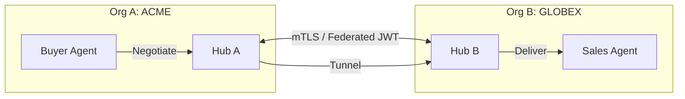

# Design Doc: Cross-Org Collaboration (B2B Agent Exchange)

**Author(s):** Antigravity
**Status:** Roadmap / Proposed
**Last Updated:** 2026-03-17

## 1. Overview
The **B2B Agent Exchange** allows two independent OHC organizations (e.g., `acme.corp` and `globex.com`) to bridge their AI workforces. This enables use cases like automated procurement (Acme's Buyer Agent negotiating with Globex's Sales Agent) or shared project management.

## 2. Technical Architecture

### 2.1 Trust Domain Peering
OHC uses SPIFFE federation to establish trust.
- **OIDC Discovery**: Each organization publishes its JWKS (JSON Web Key Set) at a public endpoint (e.g., `https://ohc.acme.corp/.well-known/jwks.json`).
- **Mutual Trust**: Org-A imports Org-B's OIDC issuer, allowing Org-A's Hub to verify SVIDs presented by Org-B's agents.

### 2.2 The Inter-Org Gateway (`b2b-gateway`)
A hardened service that handles cross-org ingress.
- **Request Tunneling**: Agent messages are encapsulated in a `B2BMessage` envelope and sent over mTLS.
- **Filtering**: Org admins must explicitly whitelist "Open Collaboration Rooms" and permitted agent roles.



## 3. Data Model Extensions

### 3.1 Trust Agreement (`srcs/domain/b2b.go`)
```go
type TrustAgreement struct {
    ID          string   `json:"id"`
    PartnerOrg  string   `json:"partner_org"`
    PartnerJWKS string   `json:"partner_jwks_url"`
    AllowedRoles []string `json:"allowed_roles"`
    Status      string   `json:"status"` // PENDING, ACTIVE, REVOKED
}
```

## 4. Security & Governance
- **Data Perimeter**: Messages entering an Inter-Org Room are flagged with `CrossOrg: true`. These messages are never used for local agent "Long-term Memory" training to prevent IP leakage.
- **Revocation**: Admins can instantly "Sever the Bridge" by deleting the `TrustAgreement`, which invalidates all active inter-org sessions.

## 5. Implementation Roadmap
1. **Phase 1**: OIDC-based Federated JWT validation.
2. **Phase 2**: `B2B Gateway` for tunneling simplified agent messages.
3. **Phase 3**: Shared persistent meeting rooms with multi-org audit logs.
