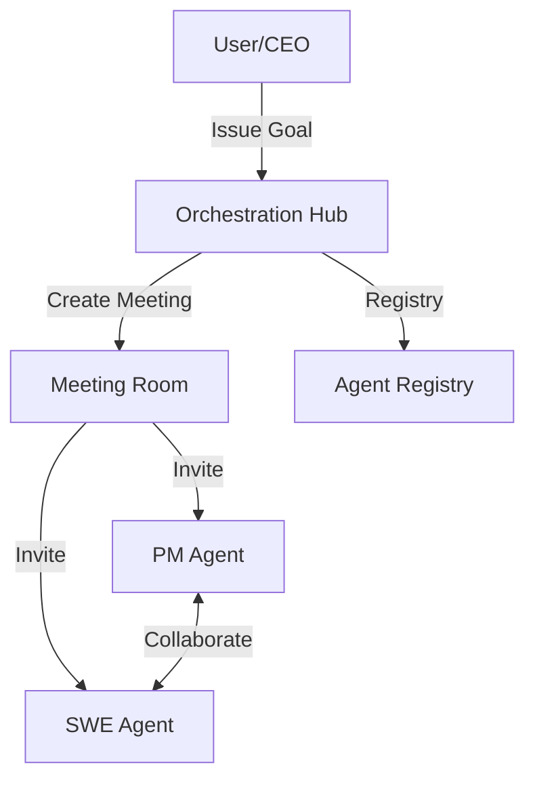

# Design Doc: Core Orchestration Engine

**Author(s):** Antigravity
**Status:** In Review
**Last Updated:** 2026-03-17

## Overview
The Core Orchestration Engine is the central brain of One Human Corp. It manages agent lifecycle, task delegation, and role-based coordination. It allows multiple specialized AI agents to work together towards a high-level goal defined by the CEO.

## Goals
- Provide a robust framework for agent communication.
- Enable dynamic role assignment based on task requirements.
- Maintain persistent state across long-running agent workflows.

## Non-Goals
- Directly implementing specific skill logic (this is handled by Skill Packs).
- Managing underlying infrastructure (handled by the OHC Kubernetes Operator).

## Proposed Design
The engine is built on an asynchronous, event-driven architecture. The `Hub` acts as the central coordinator, maintaining a registry of all active agents and meeting rooms.

### Architecture Diagram

### Data Model
- **Agent**: Represents a specialized AI worker with a role, model, and identity.
- **MeetingRoom**: A persistent context for collaboration.
- **Task**: A unit of work assigned to an agent or group.

## Alternatives Considered
- **Stateless Orchestration**: Initially considered, but rejected because agent collaborations require long-term context and memory persistence.

## Cross-cutting Concerns
### Security
- Every agent call is authenticated.
- SPIFFE SVIDs are used for inter-service communication.

### Scalability
- The Hub is designed to scale horizontally across multiple instances, using Redis for state synchronization.
