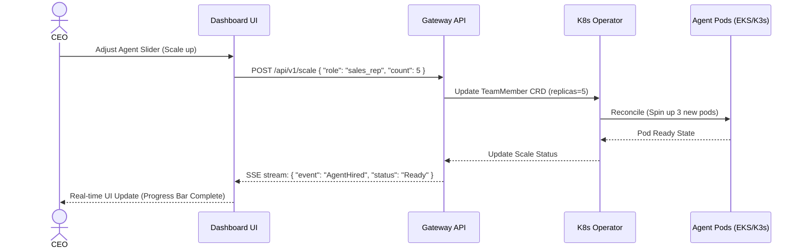

# Design Doc: Dynamic Scaling (Hire/Fire) UI

<strong>Premium OHC Design Token:</strong> This interface adheres to the Glassmorphism aesthetic mandate.

Date: 2024-05-18

## 1. Core User Journey (CUJ)
The CEO realizes that a surge in inbound marketing leads has bottlenecked the Sales Representatives. To capitalize on the traffic, the CEO navigates to the "Dynamic Scaling" tab in the Dashboard. The UI displays the current organizational compute allocation.
With a single slider interaction, the CEO scales the "Sales Representative" role from 2 to 5 concurrent agents. The Dashboard instantly issues a JSON scaling intent to the backend API, triggering the K8s Operator to reconcile the `TeamMember` resource count. Real-time trace logs confirm that new agents are "Hired" and spinning up.

## 2. Premium Aesthetic Specification

### CSS Tokens (Zero Trust & Premium Design)
- `--bg-primary`: `#0A0A0A`
- `--bg-panel`: `#1A1A1A`
- `--text-primary`: `#F3F4F6`
- `--text-secondary`: `#9CA3AF`
- `--accent-hire`: `#10B981` (Emerald 500 - for adding agents)
- `--accent-fire`: `#EF4444` (Red 500 - for reducing agents)
- `--border-subtle`: `#2dd4bf20`
- `--glow-hire`: `0 0 15px rgba(16, 185, 129, 0.4)`
- `--glow-fire`: `0 0 15px rgba(239, 68, 68, 0.4)`

### Transitions & Animation
- **Slider Thumb**: `transition: transform 0.2s cubic-bezier(0.4, 0, 0.2, 1);`
- **Panel Elevation**: On hover, elevate panel with a subtle glow: `box-shadow: var(--glow-hire); transition: box-shadow 0.3s ease;`
- **Skeleton Loading**: For real-time trace events, use a sweeping linear gradient `background: linear-gradient(90deg, #1A1A1A 25%, #2A2A2A 50%, #1A1A1A 75%); animation: shimmer 1.5s infinite;`

## 3. Data Flow Architecture (Mermaid)

