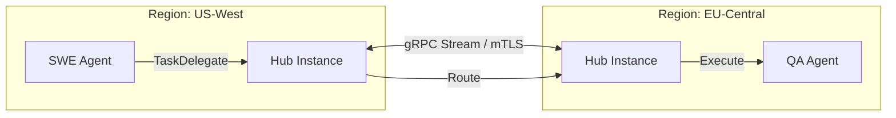

# Design Doc: Multi-Cluster Federation (Global Scale)

**Author(s):** Antigravity
**Status:** Roadmap / Proposed
**Last Updated:** 2026-03-17

## 1. Overview
As OHC scales to global enterprises, a single Kubernetes cluster becomes a single point of failure and a latency bottleneck. This design extends the Hub to support **Multi-Cluster Federation**, allowing agents to collaborate across disparate geographic regions (e.g., `us-east-1` and `eu-central-1`) while maintaining a unified identity and state model.

## 2. Technical Architecture

### 2.1 Cross-Cluster Identity (Federated SPIRE)
We leverage SPIRE's federation capabilities. Organizations will have a "Root Trust Domain" (e.g., `ohc.global`) and regional domains (`us.ohc.global`, `eu.ohc.global`).
- **SVID Validation**: A `spire-agent` in `eu` can validate an X.509 SVID from `us` using the Federated Bundle endpoint.
- **mTLS**: All Cross-Cluster A2A traffic is encrypted via mTLS using regional SVIDs.

### 2.2 Global Hub Routing (`hub-router`)
A new component, the `HubRouter`, is deployed as a global singleton (or highly available multi-region mesh).
- **Latency-Aware Placement**: When "Hiring" an agent, the Hub selects the cluster with the lowest latency to the primary data sources (e.g., if the code is in GitHub `us-west`, the SWE agent is scheduled in `us-west`).
- **Message Sharding**: Meeting room transcripts are sharded by `Home Region` but replicated for read-only access in other regions.



## 3. Data Model Extensions

### 3.1 Federated Agent Registry (`srcs/domain/federation.go`)
```go
type FederatedAgent struct {
    AgentID      string `json:"id"`
    HomeCluster  string `json:"home_cluster"`
    Status       string `json:"status"` // GLOBAL_IDLE, BUSY
    LatencyScore int    `json:"latency_ms"`
}
```

## 4. Scalability & Availability
- **Disaster Recovery**: If one cluster fails, the `HubRouter` automatically re-assigns `IDLE` agents to healthy clusters.
- **State Synchronization**: Persistent room states are synchronized via cross-region Postgres (CNPG) replication or a global Redis mesh (e.g., Redis Enterprise).

## 5. Security Considerations
- **Boundary Control**: Network Policies restrict cross-cluster traffic to the `hub-router` and `mcp-gateway` ports only.
- **Data Sovereignty**: Certain agents (e.g., `EU_LEGAL_BOT`) can be pinned to specific clusters to ensure data never leaves a geographic boundary.

## 6. Implementation Roadmap
1. **Phase 1**: Implement SPIRE Federation and mTLS cross-cluster ping.
2. **Phase 2**: Deploy regional Hubs with a shared global Postgres backend.
3. **Phase 3**: Introduce the `HubRouter` for intelligent task delegation.

## 7. Implementation Details
- **Stack:** Go 1.25, Bazel 9.0.0, Postgres, Redis.
- **Deployment:** Kubernetes via custom OHC Operator.
- **Communication:** Pub/Sub for async, gRPC/MCP for sync tool calls.
- **Code Organization:** Services located in `srcs/` and proto definitions in `srcs/proto/`.

## 8. Edge Cases
- **Network Partitions:** Fallback to cached state and retry logic for tool calls.
- **Database Unavailability:** Circuit breakers open, gracefully degrade to read-only mode if possible.
- **Context Window Bloat:** Agent memory is forcefully summarized to fit within token limits, potentially losing subtle historical nuances.
