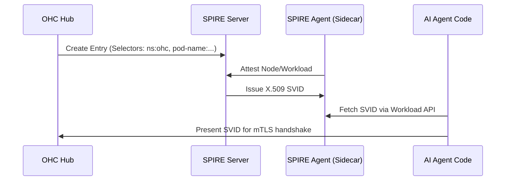

# Design Doc: Hybrid Identity Management (SPIFFE/SPIRE)

**Author(s):** Antigravity
**Status:** Approved
**Last Updated:** 2026-03-17

## 1. Overview
One Human Corp (OHC) provides a secure, verifiable identity for every entity in the system, whether human or AI. This is achieved through a "Hybrid Identity" model: OIDC federation for humans and SPIFFE/SPIRE for AI workload identity. This ensures that every tool call or inter-agent message is cryptographically signed and auditable.

## 2. Goals & Non-Goals
### 2.1 Goals
- **Zero-Trust Networking**: Enforce mTLS for all cross-service and cross-agent traffic.
- **Automated Rotation**: SVIDs (X.509 SVIDs) must be short-lived (e.g., 1 hour) and rotated without downtime.
- **Traceable Attribution**: Map every `spiffeID` back to a specific `MemberID` in the OHC Org Chart.
### 2.2 Non-Goals
- **Replacing Corporate IDP**: OHC federates with existing IDPs (Okta, Google, etc.); it does not aim to be the primary user directory.
- **Standalone PKI**: We use SPIRE for certificate orchestration rather than managing a custom CA.

## 3. Detailed Design

### 3.1 SPIFFE ID Structure
IDs are structured to reflect the OHC hierarchy and trust domain:
- **Agents**: `spiffe://ohc.local/org/{orgID}/agent/{agentID}`
- **Services**: `spiffe://ohc.local/service/{serviceName}` (e.g., `spiffe://ohc.local/service/billing`)

### 3.2 SVID Issuance Flow

### 3.3 Identity Revocation
When an agent is "Fired" (`POST /api/agents/fire`), the OHC Hub immediately:
1. Deletes the corresponding entry in SPIRE Server.
2. Triggers an SVID cache invalidation in the `MCP Gateway`.
3. Logs the revocation event to the audit trail for compliance.

## 4. Cross-cutting Concerns
### 4.1 Scalability
The SPIRE Server is deployed in a High Availability (HA) configuration using the `Postgres` backend (CNPG). SPIRE Agents run as `DaemonSets` on every Kubernetes node to minimize Workload API latency.
### 4.2 Disaster Recovery
Trust bundles are backed up to S3. In the event of a total SPIRE failure, the `Hub` can fallback to "Static Pre-shared Keys" (SPSK) for emergency operations (Configured via `OHC_IDENTITY_FALLBACK`).

## 5. Alternatives Considered
- **Kubernetes Native Certificates**: Too tied to K8s; difficult to extend to "Hybrid" workloads (agents running on-prem or in Edge devices). **Rejected**.
- **Static API Keys**: High risk of credential leakage in multi-agent LLM prompts. Zero rotation. **Rejected**.

## 6. Implementation Stages
- **Phase 1**: SPIRE Server/Agent deployment via Helm (COMPLETE).
- **Phase 2**: mTLS enforcement on the MCP Gateway (IN-PROGRESS).
- **Phase 3**: OIDC Federation for Human CEO login (BACKLOG).

## 7. Implementation Details
- **Stack:** Go 1.25, Bazel 9.0.0, Postgres, Redis.
- **Deployment:** Kubernetes via custom OHC Operator.
- **Communication:** Pub/Sub for async, gRPC/MCP for sync tool calls.
- **Code Organization:** Services located in `srcs/` and proto definitions in `srcs/proto/`.

## 8. Edge Cases
- **Network Partitions:** Fallback to cached state and retry logic for tool calls.
- **Database Unavailability:** Circuit breakers open, gracefully degrade to read-only mode if possible.
- **Context Window Bloat:** Agent memory is forcefully summarized to fit within token limits, potentially losing subtle historical nuances.
