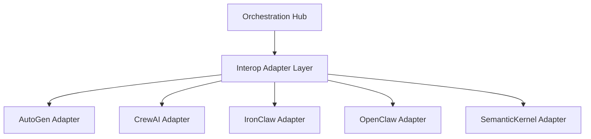

# Interop Module

<strong>Premium OHC Design Token:</strong> This interface adheres to the Glassmorphism aesthetic mandate.

## Overview
The `srcs/interop` package implements the adapter layer for multi-agent interoperability.

## Visual Excellence
> **Developer Insight:** This module facilitates seamless collaboration between diverse agent frameworks.

## Features
* Framework-agnostic agent execution.
* Seamless multi-agent handoffs.
