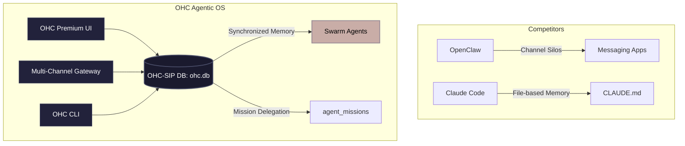

# OHC Swarm: Market Audit & Evolution Mission (2026)

## 1. Executive Summary
As part of the OHC Swarm continuous evolution initiative, this document outlines the findings of a comprehensive audit of leading AI agent platforms: **OpenClaw**, **Claude Code**, and **OpenCode**.

The objective is to identify the next "Unfair Advantage" for the One Human Corp (OHC) Agentic OS by analyzing competitive architectures across multi-channel routing, session persistence, and capability plugin (MCP) integrations.

## 2. Competitive Analysis

### OpenClaw
*   **Focus**: Multi-channel gateway for messaging platforms (WhatsApp, Telegram, Discord, iMessage).
*   **Key Capabilities**: Self-hosted agent routing, isolated per-agent sessions, plugin channels.
*   **Takeaway**: OpenClaw excels at bringing agentic capabilities directly to users via existing consumer messaging channels rather than relying purely on a terminal or IDE.

### Claude Code
*   **Focus**: Sub-agent orchestration and persistent memory.
*   **Key Capabilities**: CLI-native operation, memory persistence via `CLAUDE.md`, deep integration with IDE environments.
*   **Takeaway**: Claude Code sets the standard for long-term project grounding and sub-agent delegation, making memory a critical component of agent intelligence.

### OpenCode
*   **Focus**: Context indexing and project-level grounding.
*   **Key Capabilities**: Uses `AGENTS.md` for project initialization and rules. TUI/CLI/IDE interfaces with flexible LLM provider routing.
*   **Takeaway**: Emphasizes granular control over agent capabilities, rules, and model routing at the project level.

## 3. OHC's Unfair Advantage & Identified Delta

**The Delta**: While competitors rely on static configuration files (`AGENTS.md`, `CLAUDE.md`) or disjointed session managers, OHC possesses a foundational **Kubernetes-native, Database-Driven Orchestration** model (via OHC-SIP and `ohc.db`). However, OHC currently lacks native multi-channel persistence that seamlessly bridges the gap between different access modes (e.g., terminal, web, mobile).

**The Unfair Advantage**: By leveraging the `ohc.db` (`swarm_memory` and `agent_status`), OHC can provide **Ubiquitous Session Persistence** across all interfaces. An agent's context and session state will be perfectly synchronized, allowing a task started in a multi-channel environment (like Discord/Telegram, taking inspiration from OpenClaw) to seamlessly continue in a Web UI or CLI, backed by persistent episodic memory.

## 4. Proposed Architecture: Evolution Mission

To bridge this delta, a new Evolution Mission has been delegated to `product_architecture`.

### Mission Brief: Ubiquitous Session Persistence

*   **Objective**: Implement database-driven session state synchronization to enable seamless multi-channel routing.
*   **Implementation**: Enhance the OHC-SIP (Swarm Intelligence Protocol) to track session state independent of the frontend channel.
*   **Expected Outcome**: Users can initiate complex tasks via mobile channels and resume context-perfectly on the desktop IDE, outperforming OpenClaw's and Claude Code's siloed session approaches.

## 5. Visual Architecture



## 6. OHC Aesthetic Mandate (Premium Styling)

*The UI implementation of this feature must adhere to the OHC Premium Aesthetic:*

```css
/* Glassmorphism Token Example */
.ohc-session-panel {
    background: rgba(255, 255, 255, 0.05);
    backdrop-filter: blur(20px) saturate(200%);
    -webkit-backdrop-filter: blur(20px) saturate(200%);
    border: 1px solid rgba(255, 255, 255, 0.1);
    border-radius: 12px;
    font-family: 'Outfit', 'Inter', sans-serif;
    color: #ffffff;
    box-shadow: 0 4px 30px rgba(0, 0, 0, 0.1);
}
```

*Status: Mission Delegated via `agent_missions`.*
