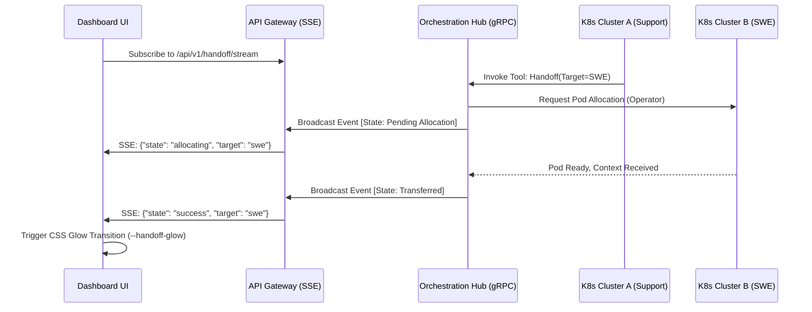

# 2024-05-18 - Cross-Cluster Handoff UI: Aesthetic & Technical Blueprint

## 1. Executive Summary & Aesthetic Spec

**Mission:** Elevate the Multi-Agent Swarm orchestration to an intuitive, cinematic experience. Cross-Cluster Handoff UI must feel instantaneous, fluid, and premium. When an agent hands off a task to another cluster, the transition should be visually continuous—a seamless bridging of neural execution.

**Aesthetic Philosophy:** "Digital Glass & Neon Arteries."
- **Color Palette:**
  - `bg-slate-950` as the canvas.
  - `emerald-400` for successful handoff pathways.
  - `amber-500` for active/pending handoff states.
  - `rose-500` for backoff/retry sequences.
- **Typography:**
  - Headers: 'Inter', tightly tracked, crisp.
  - Monospace (Logs): 'JetBrains Mono', syntax-highlighted.
- **CSS Tokens & Transitions:**
  - `--handoff-glow: 0 0 15px rgba(52, 211, 153, 0.4);`
  - `--transition-fluid: all 0.4s cubic-bezier(0.25, 0.8, 0.25, 1);`
  - Micro-interactions on nodes: On hover, pulse the glow token. On transfer, animate a glowing edge via SVG stroke-dashoffset.

## 2. Critical User Journey (CUJ)

1. **Trigger:** A Primary Agent (e.g., Customer Support) identifies a complex technical issue that requires deep backend inspection.
2. **Handoff Initiation:** The agent invokes the `handoff` tool, specifying the target `swe` (Software Engineer) agent residing in a separate high-compute K8s cluster.
3. **UI Reflection:**
   - The Dashboard visualizes the active `customer_support` node.
   - A curved, glowing path materializes, linking to a newly illuminated `swe` node.
   - An SSE stream pushes real-time telemetry (e.g., `["Transferring Context", "Acquiring Lock", "Pod Spun Up"]`).
4. **Resolution:** The `swe` node turns green; the context payload is transferred, and the execution trace continues seamlessly in the new node.

## 3. Architecture & Data Flow (Mermaid Diagram)

## 4. Technical Implementation Notes

- **K8s Operator:** Must support dynamic resource requests across distinct namespaces or federated clusters for target pods.
- **SSE Stream:** The Gateway (`/api/v1/handoff/stream`) will aggregate and push the handoff events.
- **Flutter Rendering:** The visual graph must use a lightweight SVG/Canvas overlay to render the "Neon Arteries" (the connecting curves) between agent DOM nodes, utilizing Flutter Server Components where feasible to minimize client payload.
