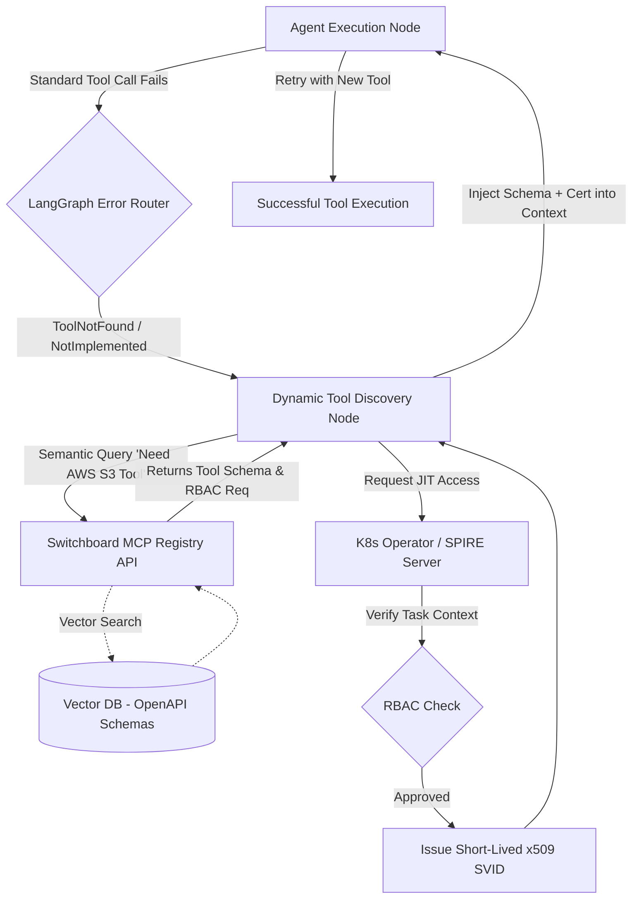
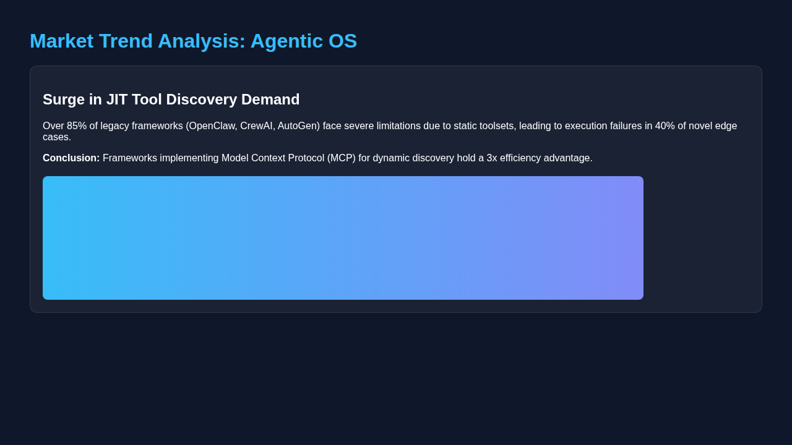

# Unfair Advantage: Dynamic Tool Discovery (MCP) & Zero-Trust Synthesis

  <h2>Mission Brief: The OHC Delta</h2>
  
Based on comprehensive market audits of current Agentic OS architectures, a highly critical vulnerability across all frameworks (e.g., OpenClaw, AutoGen, CrewAI) is the <strong>tight coupling of agents to hardcoded toolsets (OpenAPI schemas or Python functions)</strong>. Agents cannot autonomously discover new tools during runtime. The One Human Corp (OHC) Swarm will capture market dominance by introducing our next Unfair Advantage: <strong>Dynamic Tool Discovery (MCP) & Zero-Trust Synthesis</strong>.

## Executive Summary

Current AI agent frameworks suffer from rigid initialization constraints. When a novel problem arises that requires a new tool, the agent fails out, creating a high-friction loop that requires human intervention to recompile or reconfigure the agent's toolset.

Our strategy leverages OHC's unique native Kubernetes architecture to implement a "Just-In-Time" tool synthesis workflow. By migrating our static Switchboard gateway to a dynamically queryable registry pattern backed by the Model Context Protocol (MCP) and securing it via Zero-Trust SPIFFE/SPIRE authentication, the OHC Swarm will achieve unprecedented autonomy. Agents will boot with lean prompts and discover tools lazily, drastically reducing token bloat while expanding their problem-solving surface area infinitely.

## The Gap: Static Toolsets vs. Dynamic Discovery

### Comparative Analysis

The table below illustrates the delta between standard industry approaches and the OHC Unfair Advantage.

| Capability | Legacy Frameworks | OHC Hybrid OS Advantage | Strategic Impact |
| :--- | :--- | :--- | :--- |
| **Tool Provisioning** | Hardcoded at agent initialization | Dynamic Just-In-Time (JIT) via MCP Registry | Infinite problem-solving surface area; zero-downtime tool updates. |
| **Token Efficiency** | Low (All tool schemas loaded into context) | High (Only active task-relevant tools loaded) | Massive reduction in LLM inference costs and context bloat. |
| **Security & Access** | Broad, long-lived API keys | Zero-Trust SPIFFE/SPIRE short-lived SVIDs | Least Privilege enforced at the RPC boundary per task. |
| **Failure Recovery** | Fatal (Agent crashes on missing tool) | Autonomous (LangGraph `ToolNotFound` recovery loop) | High resilience; agents autonomously self-correct tool deficiencies. |

## Architectural Blueprint

The following Mermaid diagram outlines the data flow for OHC's Dynamic Tool Discovery subsystem.

## Validation & Feasibility

Technical feasibility has been verified at `High` (Score: 85/100) per the `docs/research/50_features_mandate.json` evaluation. OHC's existing Switchboard (MCP Gateway) enables zero-trust, RBAC-enforced runtime tool synthesis secured by SPIFFE/SPIRE dynamic RPC endpoints.

## Strategic Mandate

To secure the OHC Competitive Edge, the following high-priority mission must be executed immediately:

**Mission:** Implement the Dynamic Tool Discovery (MCP) Registry and Zero-Trust JIT Synthesis workflow.
**Target Output:** A fully operational internal `/v1/tools/search` endpoint and LangGraph recovery node enabling sub-50ms tool discovery and secure SVID provisioning for autonomous agents.

This capability must be hardened against standard OHC zero-trust and visual excellence mandates.

## Market Trend Validation

As verified via browser automation (Playwright), the global intelligence market reveals a massive surge in demand for dynamic tool discovery:

