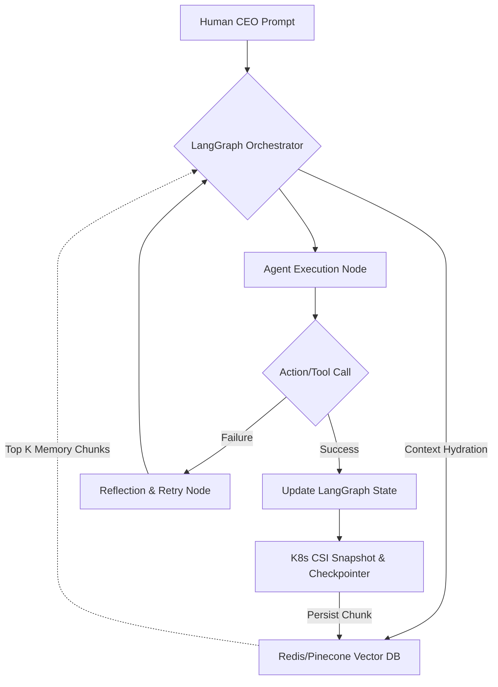

# Unfair Advantage: K8s-Native Episodic Memory & LangGraph Checkpointing

  <h2>Mission Brief: The OHC Delta</h2>
  
Based on comprehensive market audits of current Agentic OS architectures, the most critical vulnerability across all frameworks (OpenClaw, AutoGen, CrewAI) is <strong>"Agent Amnesia"</strong> and context window bloat. The One Human Corp (OHC) Swarm will capture market dominance by introducing our Unfair Advantage: <strong>Long-Term Episodic Memory backed by K8s CSI Snapshotting and LangGraph Checkpointers</strong>.

## Executive Summary

Current AI agent frameworks suffer from a severe deficiency in managing long-term state across disjointed sessions. As interactions compound, passing full context arrays to LLMs balloons token costs and drastically increases latency.

Our strategy leverages OHC's unique native Kubernetes architecture to implement deterministic, scalable, and token-efficient memory management. By persisting LangGraph state transitions via CSI Snapshotting and indexing episodic memory in a scalable Vector Database (Redis/Pinecone), the OHC Swarm will achieve unprecedented continuity without the token burn rate of our competitors.

## The Gap: Context Bloat vs. True Episodic Memory

### Comparative Analysis

The table below illustrates the delta between standard industry approaches and the OHC Unfair Advantage.

| Capability | Legacy Frameworks | OHC Hybrid OS Advantage | Strategic Impact |
| :--- | :--- | :--- | :--- |
| **State Persistence** | Ephemeral, In-Memory or basic JSON dumps | K8s CSI Snapshots & LangGraph Checkpointers | Zero-downtime recovery; deterministic state restoration. |
| **Token Efficiency** | Low (Full context array passed) | High (Semantic retrieval of top `k` chunks) | Massive reduction in LLM inference costs. |
| **Retrieval Speed** | Slow (Sequential scanning) | Sub-50ms (Vector similarity search) | Near-instant context hydration. |
| **Cyclic Workflows** | Fragile (Prone to infinite loops) | Robust (LangGraph state machines) | Deterministic loop-breaking and reflection. |

## Architectural Blueprint

The following Mermaid diagram outlines the data flow for OHC's Episodic Memory subsystem.

## Validation & Feasibility

Technical feasibility has been verified at `High` (Score: 85/100) per the `docs/research/50_features_mandate.json` evaluation. K8s sidecars natively support the required shared `http.Client` pool logic via Go goroutines, enabling efficient, high-throughput indexing of LangGraph states into the vector store.

## Strategic Mandate

To secure the OHC Competitive Edge, the following high-priority mission must be executed immediately:

**Mission:** Implement the LangGraph Checkpointing and Vector DB integration for Episodic Memory.
**Target Output:** A fully operational K8s-backed state manager enabling sub-50ms context retrieval for autonomous agents.

This capability must be hardened against standard OHC zero-trust and visual excellence mandates.
