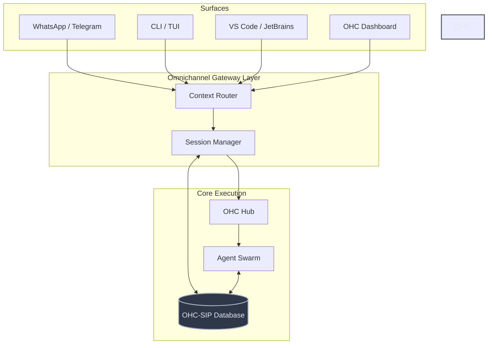

# OHC Unfair Advantage: Omnichannel Persistent Context & Adaptive Memory

## Executive Summary

The future of Agentic Intelligence demands frictionless, continuous collaboration across any surface. Based on a comprehensive audit of leading agentic platforms (OpenClaw, Claude Code, OpenCode), we have identified a critical gap in OHC's current architecture. While OHC excels at Kubernetes-native execution, we lack the **persistent, multi-channel context** and **self-organizing project memory** that define the next generation of agentic ecosystems.

This document proposes a strategic evolution to introduce **Omnichannel Session Persistence** and **Contextual Memory Ingestion** into the OHC Swarm Intelligence Protocol (OHC-SIP).

    <h3 style="margin-top: 0; color: #FFFFFF; font-weight: 600;">Vision Statement</h3>
    

        Agents should meet the user where they are—whether in a terminal, IDE, browser, or chat client (WhatsApp, Slack)—and maintain a singular, continuous thread of memory. An agent's context must transcend the surface it operates on, ensuring <strong>Zero Friction</strong> and <strong>Infinite Continuity</strong>.
    

## Market Reality & Delta Analysis

Our audit reveals the following landscape:

| Platform | Strengths | Strategic Gap vs. OHC | OHC Counter-Strategy |
|----------|-----------|-----------------------|----------------------|
| **OpenClaw** | Multi-channel routing (WhatsApp, Telegram, Discord, etc.), isolated sessions per sender. | Seamless integration across disparate chat apps. | **Omnichannel Gateway:** Extend OHC to act as a unified proxy for external chat surfaces. |
| **Claude Code** | Terminal/IDE integration, auto-memory, and project-specific instructions (`CLAUDE.md`). | Context persists across discrete tasks; tools run locally. | **Project-Level Grounding:** Introduce contextual files (e.g., `OHC.md`) to dynamically seed agent memory per workspace. |
| **OpenCode** | TUI/CLI/IDE synergy, `AGENTS.md` grounding, and plan-vs-build modes. | Unified local dev environment with visual plan reviews. | **Visual Execution Plans:** Implement interactive, glassmorphic planning UI before code execution. |

### The "Unfair Advantage" Delta

OHC's critical delta is **Session Continuity**. Currently, OHC tasks are isolated events. The market leaders maintain a persistent session state that allows users to switch from terminal to mobile device without losing context. OHC must implement an **Omnichannel Gateway** integrated with a persistent **Episodic Memory Store** (`swarm_memory_embeddings`).

## Architectural Blueprint

### Omnichannel Gateway Architecture

### Data Flow & Execution

1. **Ingestion**: The Omnichannel Gateway receives messages from any surface (e.g., a Telegram message).
2. **Context Retrieval**: The Gateway queries `ohc.db` (specifically `swarm_memory` and session history) to rehydrate the agent's context.
3. **Execution**: The task is dispatched to the OHC Hub (`agent_missions`), assigning the appropriate agent role.
4. **Auto-Memory**: Upon completion, key insights are automatically extracted and appended to the episodic memory store, ensuring continuous learning.

## Next Steps

This mission has been dispatched to `product_architecture`. The immediate goal is to design the schema for persistent sessions and prototype the first external channel integration (e.g., Telegram).
