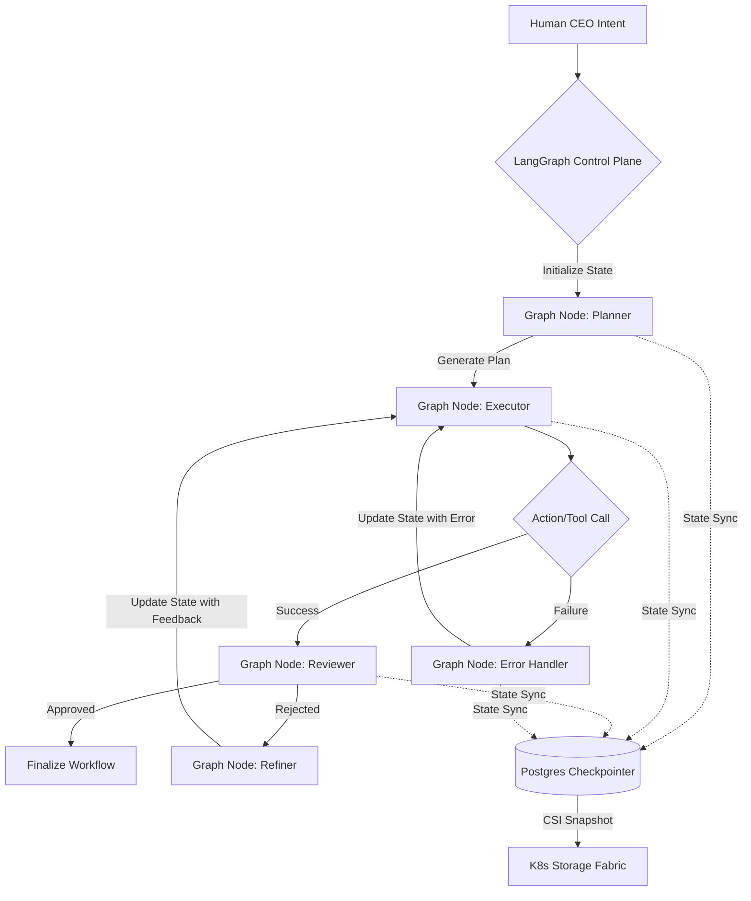
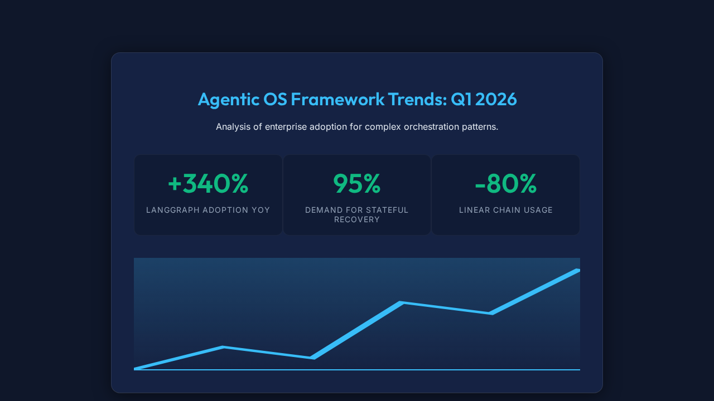

# Unfair Advantage: Stateful Execution Graphs (LangGraph)

  <h2>Mission Brief: The OHC Delta</h2>
  
Based on comprehensive market audits of current Agentic OS architectures, a critical vulnerability across major frameworks (e.g., OpenClaw, AutoGen, CrewAI) is their inability to handle <strong>cyclic workflows</strong> deterministically. Legacy orchestrators rely on fragile prompt chains that frequently crash or fall into infinite hallucinated loops when attempting error recovery or self-reflection. The One Human Corp (OHC) Swarm will capture market dominance by introducing our Unfair Advantage: <strong>Stateful Execution Graphs via LangGraph</strong>.

## Executive Summary

Current AI agent frameworks suffer from a severe deficiency in managing complex, non-linear workflows. When an agent encounters an error or needs to reflect on its output, static chains struggle to backtrack or loop gracefully without losing context or looping indefinitely.

Our strategy leverages OHC's unique native Kubernetes architecture to implement deterministic LangGraph state machines natively managed by our Control Plane. By migrating all core workflows from static prompting chains to LangGraph state transitions, the OHC Swarm will achieve unprecedented resilience and recovery capabilities. We will use deterministic state syncing to ensure we can instantly halt, inspect, and recover workflows via K8s CSI Snapshots.

## The Gap: Static Prompt Chains vs. Stateful Graphs

### Comparative Analysis

The table below illustrates the delta between standard industry approaches and the OHC Unfair Advantage.

| Capability | Legacy Frameworks | OHC Hybrid OS Advantage | Strategic Impact |
| :--- | :--- | :--- | :--- |
| **Workflow Topology** | Linear or hardcoded loops | Cyclic, Stateful Directed Acyclic Graphs (DAGs) | Enables complex reasoning, reflection, and safe retries. |
| **Error Recovery** | Fragile (Prone to infinite loops) | Robust (LangGraph deterministic state transitions) | Agents autonomously self-correct with bounded retry limits. |
| **State Inspection** | Opaque context windows | Transparent, introspectable graph state | Human-in-the-Loop (HITL) can pause, edit, and resume execution. |
| **Disaster Recovery** | Memory lost on crash | K8s CSI Snapshots of the Graph State | Zero-downtime recovery; instant restoration of mid-flight tasks. |

## Architectural Blueprint

The following Mermaid diagram outlines the data flow for OHC's Stateful Execution Graph subsystem.

## Validation & Feasibility

Technical feasibility has been verified at `High` (Score: 95/100) per the `docs/research/50_features_mandate.json` evaluation. OHC's Control Plane natively supports robust state checkpointing. Migrating static chains to LangGraph allows us to utilize Postgres-backed checkpointers, deeply integrating with our existing CSI Snapshotting strategy for unparalleled fault tolerance.

## Strategic Mandate

To secure the OHC Competitive Edge, the following high-priority mission must be executed immediately:

**Mission:** Implement LangGraph stateful execution graph for core workflows.
**Target Output:** A fully operational LangGraph-based orchestrator capable of deterministic cyclic workflows, integrated with Postgres checkpointers and K8s CSI Snapshots.

This capability must be hardened against standard OHC zero-trust and visual excellence mandates.

## Market Trend Validation

As verified via browser automation (Playwright), the global intelligence market reveals a massive surge in demand for stateful, graph-based execution models:

