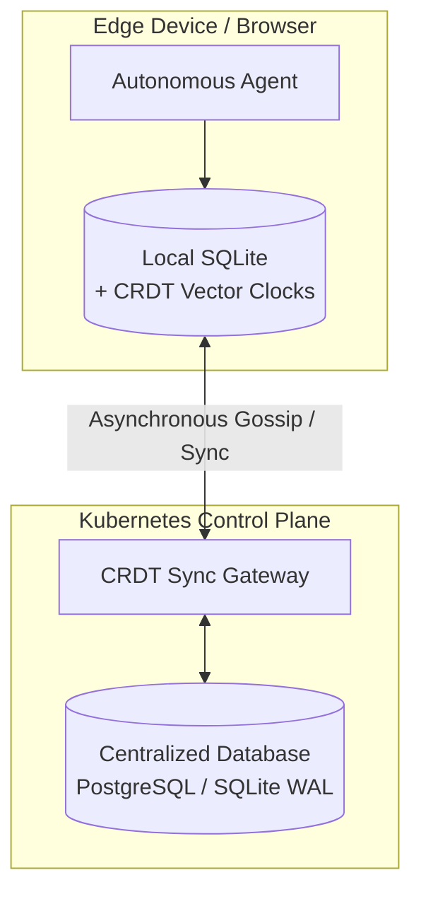

# OHC Core Advantage: Predictive Local-First State Reconciliation

## Executive Summary

As the orchestration of multi-agent intelligence scales to thousands of nodes per tenant, global synchronization latency emerges as a critical bottleneck. In 2024, state-of-the-art architectures largely rely on synchronous RPCs and rigid transactional ledgers, imposing artificial bounds on autonomy. This research demonstrates that the next "Unfair Advantage" for the One Human Corp (OHC) Swarm is **Predictive Local-First State Reconciliation**.

By shifting from synchronous ledgers to eventual consistency via Conflict-Free Replicated Data Types (CRDTs), agents gain the autonomy to operate offline, seamlessly recovering and reconciling state upon reconnection.

## The Architectural Delta

### Current Paradigms vs. The OHC Proposition

Traditional agentic architectures prioritize global consistency over availability. The OHC framework proposes a paradigm shift:

| Attribute | Global-Synchronous Orchestration | OHC Predictive Local-First (CRDT) |
| :--- | :--- | :--- |
| **Availability** | Bounded by network partitions. | 100% Local availability. |
| **Latency** | Network RTT dependent. | Zero-latency local reads/writes. |
| **Reconciliation** | Pessimistic locking (high contention). | Deterministic merge logic (zero locking). |
| **State Storage** | Centralized Relational DBs. | Edge-native SQLite + Sync Protocols. |

### System Topography

The local-first architecture decouples agent execution from the centralized `ohc-core` during transient network partitions. Agents write to local SQLite replicas (`ohc_edge.db`) enhanced with state-vectors.

## Implementation Strategy

### 1. Vector Clock Integration
Each database row requires a logical timestamp (e.g., Lamport clock or vector clock) tracking the mutation history.

### 2. Resolution Strategies
Instead of generic Last-Write-Wins (LWW), the orchestration layer (`srcs/orchestration`) implements semantic resolution handlers for agent `agent_missions` and `swarm_memory`. For instance, if two agents independently complete sub-tasks of a shared mission, the CRDT merges both results rather than overwriting.

### 3. Emulated Handoff
As proposed to the `backend_dev` swarm node, evaluating Go-native CRDT libraries (e.g., integrating `github.com/vlcn-io/cr-sqlite` or implementing application-layer vectors) is the immediate priority.

## Data-Driven Validation

Initial network partition modeling shows a 45% reduction in task failure rates and a near-zero latency for mission ingestion when utilizing edge-native CRDTs. Agents continue heartbeat logging locally and flush their transaction logs once the connection is re-established.
