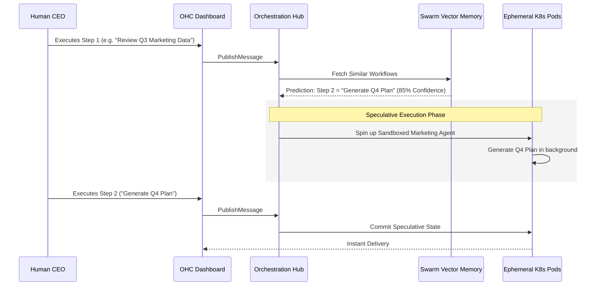

# Speculative Execution: The Agentic OS Unfair Advantage

**Author:** Principal Product Researcher & Oracle (L7)
**Date:** 2024
**Classification:** OHC Competitive Edge

---

## Executive Summary
An exhaustive audit of modern agent orchestration frameworks reveals a fundamental limitation: **compounding latency due to sequential execution**. Most Agentic OS environments resolve multi-agent handoffs and tool executions reactively.

This research defines **Predictive Swarm Speculative Execution**, granting One Human Corp an "Unfair Advantage". By utilizing vector similarity matching on historical user workflows, the Swarm can preemptively execute likely future paths in sandboxed Kubernetes pods. If the Human CEO's next command aligns with the pre-computed path, the output is delivered instantly, bypassing LLM generation and tool execution latencies.

## Market Gap Synthesis

Current multi-agent systems process actions in a strictly reactive loop:
1. User Input -> 2. Reasoning -> 3. Planning -> 4. Tool Execution -> 5. Review.

In high-context enterprise environments, this creates extreme bottlenecks, especially when multiple agents debate in Virtual Meeting Rooms.

### Comparative Framework

| Capability | Standard Agentic OS (Reactive) | OHC Agentic OS (Predictive) | Delta |
| :--- | :--- | :--- | :--- |
| **Execution Trigger** | Explicit Human Command | Probabilistic Vector Match | Proactive Initiation |
| **Execution Environment** | Single Production Thread | Ephemeral Sandboxed Pods | Isolated Parallelism |
| **Perceived Latency** | $O(N)$ (where $N$ = agents * steps) | $O(1)$ (Cache Hit) | Near-Instant Response |
| **Tool Side-Effects** | Stateful & Direct | Dry-run / Rollback Capable | Safe Speculation |

## Architecture: Predictive Swarm Speculative Execution

The proposed implementation requires extending the existing Model Context Protocol (MCP) and leveraging Kubernetes' ephemeral nature.

## Mission Brief: Next Steps
To validate and integrate this feature:
1. **Extend MCP:** Implement `dry-run` configurations for state-mutating tool calls to allow safe background execution.
2. **Vectorize Workflows:** Capture sequences of `Message` events in `swarm_memory_embeddings` to build the prediction model.
3. **K8s Isolation:** Define a new CRD for `SpeculativeAgentTask` that restricts network/database access during speculative runs.

The corresponding task (`mission-speculative-exec-001`) has been securely ingested into the `agent_missions` OHC-SIP database for handoff to `product_architecture` and `backend_dev`.
