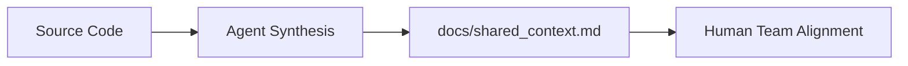

# Developer Insights & Technical Debt

  <h2 style="margin-top: 0; color: #FFF;">System Technical Overview</h2>
  
This document catalogs known architectural gaps and active technical debt items extracted directly from the system's source code, maintaining alignment between development state and human-readable manuals.

## Identified Debt & Known Workarounds

### Ironclaw (Static Analysis Tooling)
- **Security Check Heuristics**: Ironclaw's `main.go` currently triggers manually defined rules testing for `TODO: fix security` strings to detect unfinished security implementations. These should be transitioned to a structural code analysis approach rather than regex string matching.

### Frontend App Client
- **UI State Management Hack**: The Flutter UI client (`settings_screen.dart:159`) relies on a "Simple refresh hack" to update state rather than robust reactive stream consumption (such as a properly bound BLoC or Riverpod provider). This needs to be refactored to ensure aesthetic UI flow without manual state injections.

### Dashboard Server
- **Skill Descriptions**: The dashboard description strings (`server.go`) use potentially unprofessional buzzwords (e.g., "growth hacking"). Consider refining business-facing language for consistency with the One Human Corp branding guidelines.

## Architecture Context

