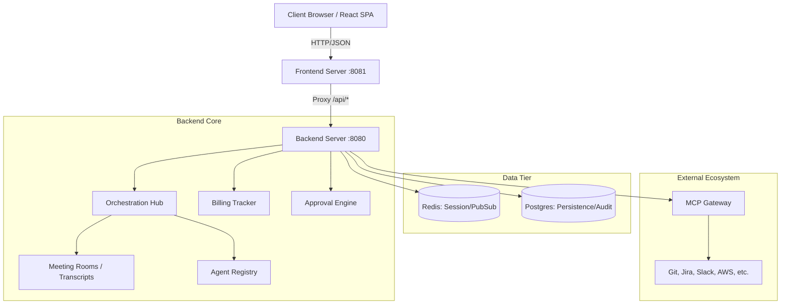
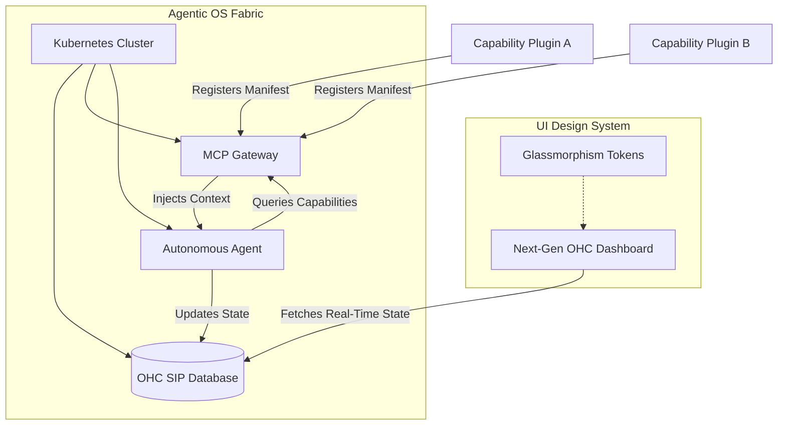

# Design Doc: One Human Corp (OHC) Platform

**Author(s):** Antigravity, Principal Product Architect & Visionary (L7)
**Status:** Approved
**Last Updated:** 2026-03-28

## 1. Overview
One Human Corp (OHC) is an enterprise-grade AI-agent orchestration platform. It enables organisations to define a virtual workforce of AI agents, assign them hierarchical roles, coordinate complex multi-agent tasks through persistence-backed "Meeting Rooms", track granular cost/billing at the token level, and gate high-risk or high-cost actions behind human approval (Confidence Gating).

The platform is built on 4 conceptual layers:
1. **Domain Knowledge**: The industry or area the corporation operates in (e.g., Software Company). This is an extensible framework; users can import new skills, areas, and domain knowledge at any time.
2. **Role**: Specific positions required within the domain. For a Software Company, this includes PM, SWE, Engineering Director, Marketing Manager, Security Engineer, QA Tester, UI/UX Designer, Sales Representative, Customer Support Specialist, and DevOps Engineer.
3. **Organization**: The management hierarchy and structure (e.g., a Director managing X PMs and Y SWEs).
4. **User**: The human user, who always acts as the CEO.

When the CEO defines a goal, the organisation works collaboratively. Agents enter **virtual meeting rooms** to discuss, define scopes, design products, and implement them autonomously, guided by their specialized roles.

## 2. Goals & Non-Goals
### 2.1 Goals
- **Autonomous Orchestration**: Enable agents to delegate tasks to specialists without human intervention.
- **Cost Observability**: Provide real-time USD cost tracking based on specific model pricing (GPT-4o, Claude 3.5, etc.).
- **Verifiable Identity**: Use SPIFFE SVIDs for mTLS-backed agent-to-agent and agent-to-tool communication.
- **Zero Lock-in**: Abstract all external tools behind the Model Context Protocol (MCP).
### 2.2 Non-Goals
- **Model Training**: OHC consumes existing LLMs via standardized providers.
- **General Purpose ERP**: While OHC manages an "org chart", it is focused on AI workflow, not traditional HR/Payroll processing.

## 3. Detailed Architecture



### 3.1 Orchestration Hub (`srcs/orchestration/`)
The `Hub` is the central coordinator using a thread-safe registry (`sync.RWMutex`). It manages:
- **Agent Lifecycle**: `RegisterAgent(Agent)`, `FireAgent(id)`.
- **Communication**: `Publish(Message)` routes events to specific agent inboxes or meeting room transcripts.
- **Meeting Rooms**: Persisted workspaces for multi-agent collaboration on specific tasks. This is where cross-functional roles (e.g., a PM, UI/UX Designer, and SWE) converse, debate constraints, define scopes, design products, and implement them based on the CEO's goal.
- **Capability Plugin Mesh**: A decentralized capability system where agents dynamically ingest "Capability Plugins" at runtime. Capabilities are hosted as standalone K8s services exposing a standardized `CapabilityManifest`, enabling agents to discover and adopt new tools and roles on the fly via the MCP Gateway.

### 3.2 Data Models (Go & Protobuf)
#### Domain Entities (`srcs/domain/organization.go`)
```go
type Organization struct {
    ID           string        `json:"id"`
    Name         string        `json:"name"`
    Domain       string        `json:"domain"`
    Members      []Employee    `json:"members"`
    RoleProfiles []RoleProfile `json:"roleProfiles"`
}
```
#### Protobuf API Contract (`srcs/proto/agent.proto`)
```protobuf
message AgentMessage {
  string id = 1;
  string sender_id = 2;
  string recipient_id = 3;
  string content = 4;
  map<string, string> metadata = 5;
}
```

## 4. API Design (Backend :8080)

| Method | Path | Request Body | Resulting State |
|--------|------|--------------|-----------------|
| `GET` | `/api/dashboard` | N/A | Returns full org, active meetings, and costs. |
| `POST` | `/api/agents/hire` | `{"name": "...", "role": "..."}` | New `Agent` in `IDLE` status in Hub. |
| `POST` | `/api/messages` | `{"fromAgent": "...", "content": "..."}` | Updates `MeetingRoom.Transcript` and triggers agent logic. |
| `POST` | `/api/approvals/decide` | `{"approvalId": "...", "decision": "approve"}` | Gates high-risk execution until human sign-off. |

## 5. Security & Trust Domain
### 5.1 SPIFFE/SPIRE Identity
Every agent workload is assigned a SPIFFE ID (e.g., `spiffe://ohc.local/agent/swe-1`). In production, the `spire-agent` sidecar provides X.509 SVIDs via the Workload API, ensuring that only authenticated agents can access the `MCP Gateway`.

### 5.2 Confidence Gating
High-risk actions (e.g., `git push`, `terraform apply`, `billing upgrade`) are intercepted by the `Guardian Agent`. The action is suspended, the state is snapshotted, and an `ApprovalRequest` is created. Execution only resumes upon a `PUT /api/approvals/decide` call with an `APPROVED` status.

## 6. Infrastructure & Deployment
### 6.1 Containerization
- **Backend/Frontend**: Built using `bazel` rules and pushed as `distroless` images.
- **Security**: Rootless execution, read-only root filesystems where possible.
### 6.2 CloudNative PG (Kubernetes)
Audit logs and snapshots are stored in a managed Postgres cluster via the CNPG operator. It provides:
- Automated failover (Leader/Follower).
- Point-in-time recovery (PITR) to S3/GCS.
- Integrated Prometheus metrics for DB health.

## 7. Monitoring & Observability
- **Metrics**: Standard `net/http` metrics + custom `ohc_tokens_consumed_total`.
- **Tracing**: W3C Traceparent propagation through agent handoffs for distributed request tracking.
- **Liveness/Readiness**: `/healthz` (service up) and `/readyz` (DB/Redis reachable).
d-to-end mTLS via SPIFFE.

## Agent Delegate Mode

An agent in "Delegate Mode" acts as a routing proxy: it inspects an incoming task, selects the best-fit specialist agent from the registry, forwards the task, and surfaces the result back to the originating caller.  The orchestration `Hub` exposes `DelegateTask(fromAgentID, toAgentID, task)` for this purpose.

## 8. Scalability
- Horizontal pod autoscaling on both `backend` and `frontend` deployments
- Redis pub/sub decouples event producers from consumers
- CloudNative PG read replicas serve read-heavy API paths

## 9. Roadmap (Google Golden Standard Extensions)

### 9.1 Phase 3: Global Scale (Multi-Cluster Federation)
Extend the OHC control plane to manage agent workloads across multiple geographic clusters.
- **Federated SPIRE**: Cross-cluster SVID validation for mTLS.
- **Global Hub Router**: Intelligent message routing based on agent locality and latency.

### 9.2 Phase 4: Autonomous Reliability (SRE Engine)
Incorporate self-healing capabilities into the core orchestration.
- **Incident Response Agents**: Agents with direct access to Prometheus/Loki for real-time RCA.
- **Auto-Rollback Gating**: Integration with ArgoCD/Flux for automated canary rollouts and AI-driven rollbacks.

### 9.3 Phase 5: Ecosystem Interoperability (B2B Collaboration)
Enable secure agent-to-agent negotiation between separate OHC organizations.
- **Trust Domain Peering**: Shared OIDC/SPIFFE trust between partner organizations.
- **Inter-Org Meeting Rooms**: Securely bridged workspaces for B2B collaboration.

### 9.4 Phase 6: Performance Optimization (Hardware-Aware Scheduling)
Optimize agent throughput by aligning LLM requirements with cluster hardware.
- **GPU Affinity Scoring**: Scheduling agents onto nodes with NVIDIA H100/A100 based on task priority.
- **VRAM Quota Management**: Granular control over VRAM consumption to prevent OOM in dense agent clusters.

## 10. Alternatives Considered

- **Custom API Integrations**: Instead of MCP, we could have built bespoke integrations for every tool. This was rejected due to lack of scalability and high maintenance cost.
- **Synchronous Agent Communication**: Initial designs considered purely synchronous A2A. This was rejected in favor of an asynchronous Pub/Sub model to handle long-running agent tasks and improve platform responsiveness.
- **SaaS-only Identity**: Using Auth0 or similar for all identities. Rejected to allow for self-hosted, air-gapped deployments and better agent workload identity (SVIDs).

## Monitoring & Observability

- **Liveness & Readiness**: `/healthz` and `/readyz` endpoints for Kubernetes probes.
- **Tracing**: OpenTelemetry traces exported to OTLP compatible backends (Jaeger, Honeycomb).
- **Logging**: Structured JSON logging via `log/slog` for automated log analysis.
- **Metrics**: Prometheus metrics for system health (CPU, Memory, Request Latency).

## 11. Modular Capability Expansion Flow

The OHC platform supports dynamic expansion and industrial-strength team instantiation via the **Modular Capability Plugin Mesh**.

1. **Discovery**: Agents query the MCP Gateway for capabilities matching their intent. Capabilities are standalone K8s services exposing a `CapabilityManifest`.
2. **Registration**: The Orchestration Hub dynamically registers new endpoints in the `capability_plugins` database table.
3. **Hydration**: The Hub automatically injects the newly discovered capabilities into the agent's context and persists embeddings into `swarm_memory_embeddings` for future semantic retrieval.
4. **Execution**: Agents immediately adopt their new roles or utilize newly bound tools to execute their directives autonomously.

## 12. Aesthetics: Next-Generation OHC Design System

To reflect the fluidity of the new Agentic OS, the OHC frontend adopts the Next-Generation "Premium Feel" Design System. The UI must hide infrastructure complexity (K8s, MCP) behind consumer-grade "Apple-level aesthetics".

### 12.1 Design System Tokens
*   **Backdrop & Depth**: Glassmorphism is the core structural element.
    *   `backdrop-filter: blur(15px) saturate(180%)`
*   **Surfaces**: Ghostly, semi-transparent layers to indicate dynamic, ephemeral agent capabilities.
    *   `background: rgba(255, 255, 255, 0.05)`
*   **Borders**: Subtle definition.
    *   `border: 1px solid rgba(255, 255, 255, 0.1)`
*   **Typography**: Clean, geometric sans-serif for clarity at a glance.
    *   `font-family: 'Outfit', 'Inter', sans-serif`
*   **Transitions**: Smooth data transitions for all asynchronous operations (e.g., capability binding).

### 12.2 Architectural Flow Diagram


