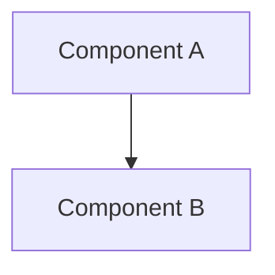

# Design Doc: [Feature Name]

**Author(s):** [Your Name]
**Status:** [Draft / In Review / Approved]
**Last Updated:** [Date]

## 1. Overview
A technical summary of the problem space, the proposed solution, and the overall impact on the OHC ecosystem.

## 2. Goals & Non-Goals
### 2.1 Goals
- Detailed, measurable goal 1.
- Detailed, measurable goal 2.
### 2.2 Non-Goals
- Explicitly state what is out of scope to prevent scope creep.

## 3. Detailed Design
### 3.1 Architecture Diagram


### 3.2 Data Model & Schema
#### Database Entities (Postgres/Redis)
[Describe columns, indexes, and relationships]
#### Protobuf Definitions
```protobuf
[Include relevant snippets from srcs/proto/]
```

### 3.3 API Design
#### REST Endpoints
- `METHOD /path`: [Detailed Request/Response JSON with field descriptions]
#### gRPC Services
- `Service.Method`: [Description of streaming/bidirectional logic]

### 3.4 Logic & Algorithms
[Describe complex state machines, agent routing logic, or billing calculations in detail]

## 4. Cross-cutting Concerns
### 4.1 Security & Identity
- How SPIFFE SVIDs are validated.
- RBAC (Role-Based Access Control) requirements.
### 4.2 Scalability & Performance
- Latency targets (P50/P99).
- Resource limits (CPU/Mem per agent).
### 4.3 Monitoring & Observability
- Custom metrics to be exported.
- Specific log fields for troubleshooting.

## 5. Alternatives Considered
- **Option A**: Deep breakdown of Pros/Cons and why it was rejected.
- **Option B**: Comparison with existing industry standards.

## 6. Implementation Plan
- Step-by-step rollout (Phases).
- Migration strategy for existing data.
