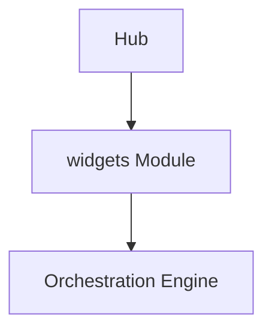

# widgets

  <h3>Overview</h3>
  
This is the premium architectural walkthrough for the <code>widgets</code> Bazel component in the OHC ecosystem.

## Architecture

```mermaid
graph TD;
    A[Hub] --> B[widgets Module];
    B --> C[Orchestration Engine];
```
