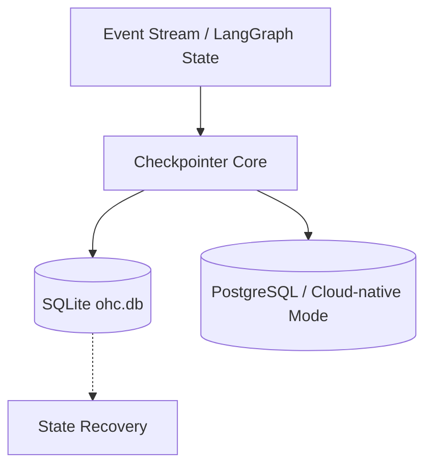

# Checkpointer

The `checkpointer` module provides the robust, append-only event logging mechanisms necessary for the Agentic OS architecture. By persisting the state of the Swarm Intelligence Protocol in real-time, it guarantees stateful episodic memory and allows resuming highly complex workflows seamlessly.

## Architecture

## Features

- **Immutable Audit Logging**: Records every tool invocation, meeting room message, and agent-to-agent handoff without mutation.
- **Fast Resumption**: Restores execution context from an event log, supporting asynchronous workflows and sub-agent delegates.

## Developer Notes

- Relies heavily on high-concurrency settings in SQLite when running locally (`_journal_mode=WAL`, `_busy_timeout=15000`, `_txlock=immediate`).
- Integration tests mock external databases but must run via `bazelisk test //srcs/checkpointer/...`.
