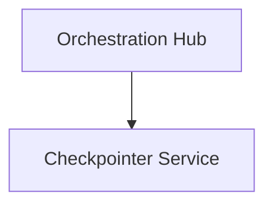

# Checkpointer Module

## Overview
This module handles the core functionality for `Checkpointer` in the One Human Corp Agentic OS.

## Visual Excellence
> **Developer Insight:** High-density architecture supporting the OHC mandate.

