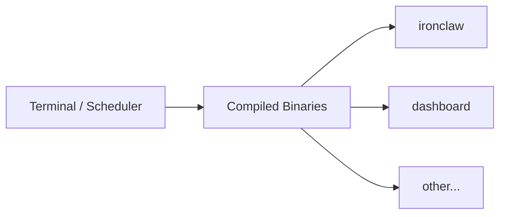

# Cmd

<div class="ohc-card" style="backdrop-filter: blur(15px) saturate(180%); background: rgba(255, 255, 255, 0.1); border-radius: 12px; padding: 20px; border: 1px solid rgba(255, 255, 255, 0.2); margin-bottom: 20px;">
The `cmd` directory houses the primary entry points for Go executable binaries within the One Human Corp monorepo. It serves as the gateway to launch backend services, orchestration tools, and various sub-agents operating in the Agentic OS.
</div>

## Architecture



## Structure

Each sub-directory within `cmd/` represents a distinct binary application built using Bazel. Common commands include:

- `cmd/ironclaw`: Execution engine entry point.
- `cmd/dashboard`: Main Go Dashboard Server.

## Building and Running

Binaries are compiled deterministically. To build or run an application, use Bazel:

```bash
# Build a binary
bazelisk build //srcs/cmd/ironclaw

# Run a binary
bazelisk run //srcs/cmd/ironclaw
```
