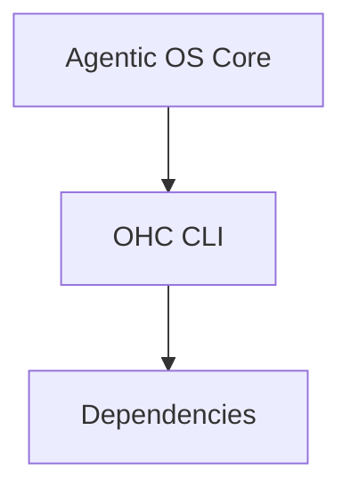

# OHC CLI

<div style="backdrop-filter: blur(20px) saturate(200%); background: rgba(255, 255, 255, 0.03); border: 1px solid rgba(255, 255, 255, 0.08); padding: 24px; border-radius: 12px; color: #E2E8F0; font-family: 'Inter', 'Outfit', sans-serif;">
  <h2 style="margin-top: 0; color: #FFF;">Overview</h2>
  <p>The <strong>OHC CLI</strong> package is a core component of the One Human Corp Agentic OS architecture, designed to provide specialized capabilities within the platform.</p>
</div>

## Architecture



## Developer Guide
- Ensure this module adheres to the **Zero Secrets Mandate** using SPIFFE/SPIRE for identity.
- Verify component functionality by executing the Bazel test targets.

```bash
bazelisk test //srcs/cmd/ohc:all
```
