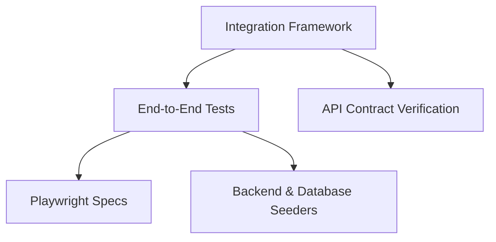

# Integration

<div class="ohc-card" style="backdrop-filter: blur(15px) saturate(180%); background: rgba(255, 255, 255, 0.1); border-radius: 12px; padding: 20px; border: 1px solid rgba(255, 255, 255, 0.2); margin-bottom: 20px;">
The `integration` package houses testing environments, frameworks, and tools used to validate interactions across multiple internal services in the OHC platform. It focuses heavily on validating inter-process communication, authentication flows (SPIFFE/SPIRE), and data propagation between the frontend, Go API, and rust core.
</div>

## Architecture



## Running the Tests

Integration tests enforce correct architectural boundaries. These are strictly run through Bazel and should never mock the network or UI when possible.

```bash
# Run all integration tests
bazelisk test //srcs/integration/...
```
