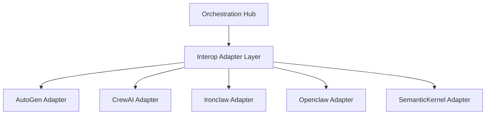

# Interop

<div class="ohc-card" style="backdrop-filter: blur(15px) saturate(180%); background: rgba(255, 255, 255, 0.1); border-radius: 12px; padding: 20px; border: 1px solid rgba(255, 255, 255, 0.2); margin-bottom: 20px;">
The `interop` package defines the multi-agent interoperability adapters, enabling One Human Corp's Swarm Intelligence Protocol (OHC-SIP) to interface seamlessly with various third-party and proprietary agent frameworks (e.g., autogen, crewai, ironclaw, openclaw, semantickernel).
</div>

## Architecture



## Developer Notes

- These adapters are organized as distinct logic paths for clean multi-agent handoffs.
- Multi-agent handoff protocols use explicit Protobuf schemas (e.g., `AgentHandoff`, `HandoffRequest`, `HandoffResponse`) defined in `srcs/proto/hub.proto` rather than generic string tasks.
- If extracting a new adapter or module, create a new directory and `BUILD.bazel` file containing a `go_library` target, and explicitly update downstream dependencies.

## Testing

```bash
# Run interop tests
bazelisk test //srcs/interop/...
```
