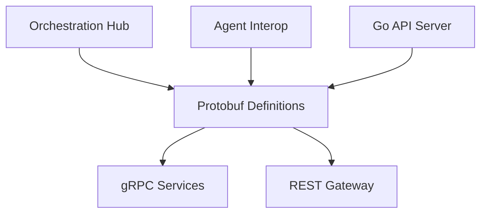

# Proto

<div class="ohc-card" style="backdrop-filter: blur(15px) saturate(180%); background: rgba(255, 255, 255, 0.1); border-radius: 12px; padding: 20px; border: 1px solid rgba(255, 255, 255, 0.2); margin-bottom: 20px;">
The `proto` directory contains Protocol Buffer definitions that serve as the universal interface definition language (IDL) for One Human Corp's Swarm Intelligence Protocol (OHC-SIP). All cross-agent communication, RPC calls, and multi-agent handoff schemas are strictly versioned here.
</div>

## Architecture



## Compilation

We rely on `rules_proto` and related Bazel plugins to natively generate Go structs, gRPC clients, and Typescript interfaces dynamically. Never commit generated protobuf files (`.pb.go`, `.pb.ts`) to the repository.

```bash
# Update generated build files and dependencies for proto
bazelisk run //:gazelle
```

## Conventions

- Use `syntax = proto3`.
- Multi-agent handoff protocols use explicit schemas (e.g., `AgentHandoff`, `HandoffRequest`, `HandoffResponse`) defined in `srcs/proto/hub.proto`.
