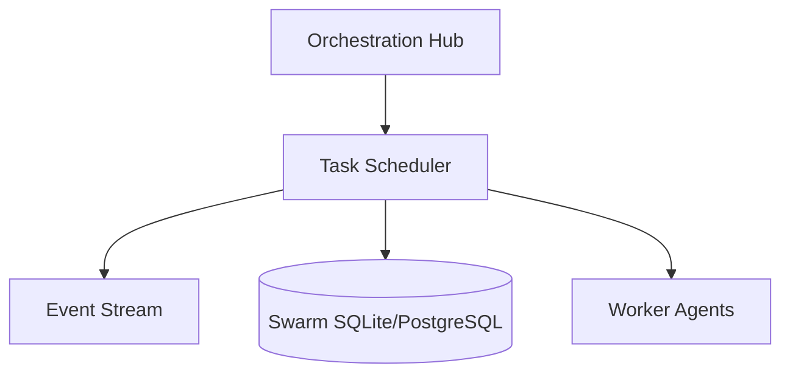

# Scheduler

<div class="ohc-card" style="backdrop-filter: blur(15px) saturate(180%); background: rgba(255, 255, 255, 0.1); border-radius: 12px; padding: 20px; border: 1px solid rgba(255, 255, 255, 0.2); margin-bottom: 20px;">
The `scheduler` package coordinates and queues tasks for AI agents within the One Human Corp ecosystem. It enforces execution sequencing, distributed cron jobs, and dependency resolution for complex asynchronous workflows.
</div>

## Architecture



## Features

- **Concurrency Control**: Manages resource-intensive agent tasks and controls rate limiting to ensure API quota integrity.
- **Workflow State Management**: Interacts deeply with `swarm_memory` and `agent_status` in the OHC-SIP database to determine the lifecycle and readiness of any scheduled multi-agent workflow.

## Running Tests

```bash
# Test the scheduler package
bazelisk test //srcs/scheduler/...
```
