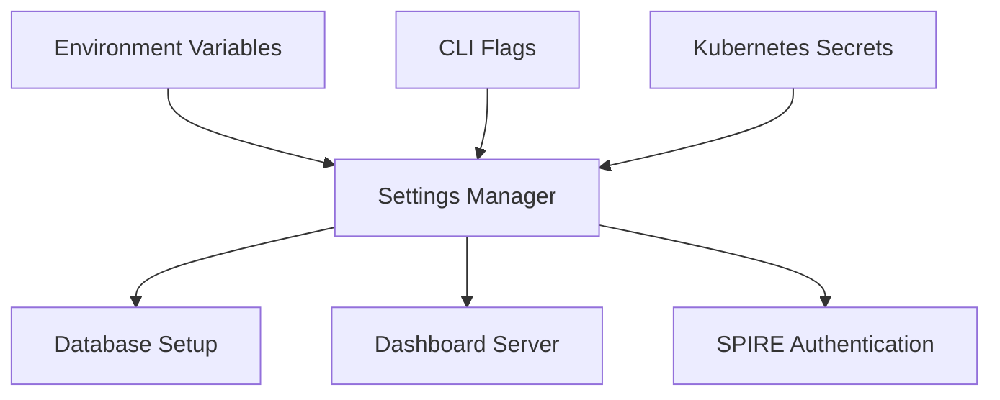

# Settings

<div class="ohc-card" style="backdrop-filter: blur(15px) saturate(180%); background: rgba(255, 255, 255, 0.1); border-radius: 12px; padding: 20px; border: 1px solid rgba(255, 255, 255, 0.2); margin-bottom: 20px;">
The `settings` package centralizes the configuration logic and defaults for the One Human Corp environment. It loads environment variables, API keys, database paths, and SPIFFE/SPIRE connectivity details necessary for secure and reliable operations across all Go components.
</div>

## Architecture



## Security Mandate

- **Zero Secrets**: Never commit secrets to the repository. The configuration framework expects short-lived certificates or secure vault injection via Kubernetes at runtime.
- For local development, configuration is driven primarily by CLI arguments to Bazel, `.env` files (ignored in version control), or environment variables.

## Running Tests

```bash
# Test the settings parser and defaults
bazelisk test //srcs/settings/...
```
